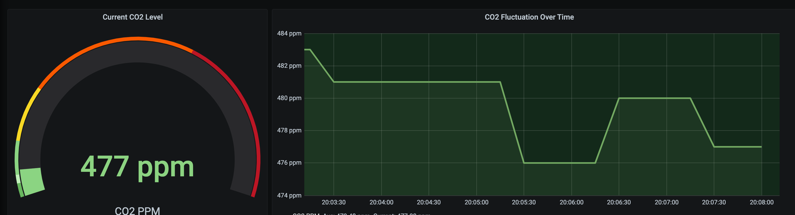
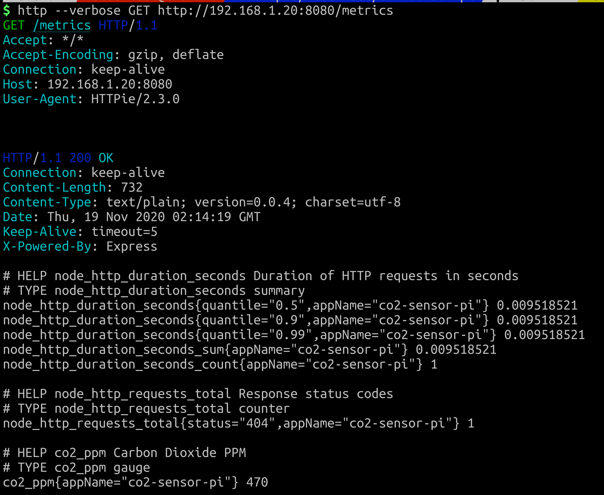

# CO2 Sensor API

This is a service created using Node intended to run on a
Raspberry Pi 4 and use a CCS811 sensor to expose metrics
that can be scrapped by Prometheus.

## Motivation

I wanted a CO2 Sensor that could start a set of fans on
my room but Airthings Wave Plus could only trigger IFTTT 
requests, but I do not want traffic out of the network.

## Hardware Required

* Raspberry Pi 4
* [KS0457 keyestudio CCS811 Carbon Dioxide Air Quality Sensor](https://wiki.keyestudio.com/KS0457_keyestudio_CCS811_Carbon_Dioxide_Air_Quality_Sensor)

## ScreenShots

## Tech

* Node v14.15.1
* Express
* raspi-i2c

